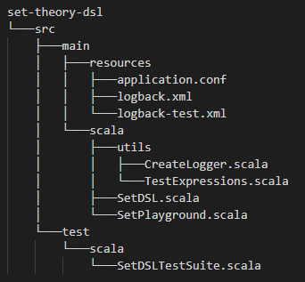

### Implementation of a Domain Specific Language to Create and Evaluate Set Theory Operations

<b><i>Anandavignesh Velangadu Sivakumar
662139789</i></b>

#### Description: 

Create a language for users of the set theory to create and evaluate binary operations on sets using variables and scopes where elements of the sets can be objects of any type. The goal is to implement a domain-specific language(DSL) for writing and evaluating set operation expressions. Through the DSL, users must be able to describe and evaluate binary operations on sets using variables and scopes and the elements of the set can be objects of any type.

#### Overview

Following operations are to be implemented

- Insert into and delete an object from a set.
- Union of the sets A and B, denoted A ∪ B, is the set of all objects that are a member of A, or B, or both.
- Intersection of the sets A and B, denoted A ∩ B, is the set of all objects that are members of both A and B.
- Set difference of U and A, denoted U \ A, is the set of all members of U that are not members of A.
- Symmetric difference of sets A and B, denoted A ⊖ B, is the set of all objects that are a member of exactly one of A and B (elements which are in one of the sets, but not in both). For instance, for the sets {1, 2, 3} and {2, 3, 4}, the symmetric difference set is {1, 4}. It is the set difference of the union and the intersection, (A ∪ B) \ (A ∩ B) or (A \ B) ∪ (B \ A). 
- Cartesian product of A and B, denoted A × B, is the set whose members are all possible ordered pairs (a, b), where a is a member of A and b is a member of B.

Here's an example,
```scala
//creating a set and populating it with objects. The operation Assign locates a set object
//given its name or creates a new one if it does not exist. The second parameter is the
//operation Insert that adds objects to the set. The first parameter of the operation Insert
//is an object that is referenced by the variable var, the second is an integer and the third is a string.
Assign(Variable("someSetName"), Insert(Variable("var"), Value(1)), Value("somestring"))
//check if an object is in the set
Check("someSetName", Value(1)) //it should return the boolean value true
//in this example we define a macro and use it in the set operation to delete an object
//referenced by the variable "var"
Macro("someName", Delete(Variable("var")))
Assign(Variable("someSetName"), Macro("someName"))
//this example shows how users can create scope definition and use
Scope("scopename", Scope("othername", Assign(Variable("someSetName"), Insert(Variable("var"), Value(1)), Value("somestring"))))
Assign(Scope("scopename", Scope("othername", Variable("someSetName"))), Insert(Value("x")))
```

#### Functionality

A set as a collection of well defined objects which are distinct from each other, thus a set can be defined as a function - S: Object => Boolean. That is, given an Object, it maps the Object to a Boolean, **true** if the object is in the set and **false** otherwise. Hence, the underlying data structure can be some collection classes like List or Map to store the objects.

In the DSL, scopes can be created dynamically as part of the expressions in addition to being predefined in the environment. Macros will use lazy evaluation to substitute the expression for a given macro name in the expressions where the macro name is used.

This requirement can be divided roughly into five steps. 
1) Design a DSL for set theory operations evaluation. Add the logic for binding set objects to variables. 
2) Create an implementation of scopes, named and anonymous with scoping rules for obscuring and shadowing that you define to resolve the values of variables that have the same names in expressions. 
3) Create macros to substitute macro definitions for the used macro names in expressions. 
4) Add Scalatest tests to verify the correctness of your implementation. 
5) Write a report to explain your implementation and the semantics of your language.

#### Installation

Tools: IntelliJ IDEA 2021.2.1(Community Edition), jdk 1.8.0_191, Scala 3.0.2, sbt 1.6.2

##### To build the project:
* Clone this repository through command line using 
```
> git clone https://github.com/gnzeleven/set-theory-dsl
```
* Open IntelliJ IDEA and navigate File -> Open Folder -> set-theory-dsl
* To run tests, use the command 
```
> sbt clean compile test
```
* To build, run 
```
> sbt clean compile run
``` 
in the command line or 
```
> clean compile run
``` 
sequentially in sbt shell

#### Project Structure



#### Implementation

The underlying data structures used to implement the Domain Specific Language for evaluating set theory expression are mutable Set and mutable Map. Set is abstracted by all the expressions except for the Assign, Macro, and Scope expressions, as they use Map to store the references to the variables in scopes. The primitive expression Variable, on evaluation, returns the set referenced by the variable in the possible scopes and Value abstracts a single constant or literal and return the abstracted literals when evaluated.

Assign, as the name implies, assigns the evaluated expression to the variable in the current scope(for Insert) or in the scope where the variable exists in the case of Update and Delete expressions. The variable's reference is searched for recursively starting from current scope until we encounter the variable or we hit the global scope(meaning the variable does not exist anywhere). In case the variable doesn't exist, the program throws an exception which is handled within the Insert/Delete expression's evaluate method. This is not so for Insert as Insert is equivalent to declaring and defining a variable within the current scope.

Check expression evaluates the variable in the execution context cache and we check whether the object is present in the set represented by the variable.

Initially, an Expression that is evaluated starts with current scope as the global scope. Any variables that are evaluated using an Assign statement takes its place in the current scope which is the global scope. Let us assume that a Scope statement is encountered. The program checks if the scope exists within current scope. If it does, just switch the current scope to the scope is called for. Otherwise, create a new scope within the current scope and switch the current scope to the new scope. 

While this is being done, it must be noted that the inner scope can access all the variables within it hierarchy of parent scopes. Inorder to accomplish this in an optimized manner, the current scope is copied to a cache every time context is switched. Now, within the current scope, all the lookup for the variable references are first checked within the current scope(because current scope has the highest priority) and then the program searches in the transient execution context(the cache). This is optimized because the search doesn't happen recursively in all the parent scopes every time we look for a variable's reference, that is to say we limit the search space to the current scope or the cache of execution scope. A tradeoff of memory for perfomance. This is how context switching through Scope statement is handled.

Finally, all the set operations' evaluate methods are defined. Because, the program uses a mutable Set that is encapsulated by the Expression statements. The evaluations of set operations Union, Intersection, Difference, SymmetricDifference, and CartesianProduct are implemented functionally using the methods defined within the Scala's mutable.Set interface. 

#### Sample Execution

```scala
// create a new variable - meaningOfLife and assign a value
Assign(Var("meaningOfLife"), Value("The meaning of life is 42")).evaluate()
// create a new variable - newMeaningOfLife and assign evaluation of an insert statement
Assign(Var("newMeaningOfLife"), Insert(Seq(Var("meaningOfLife"), Value(42)))).evaluate()
// trying to update a variable that doesnt exist will throw an exception that is handled
Assign(Var("thisDoesntExist"), Update(Seq(Value("I do not exist")))).evaluate()
// create a new macro and execute
Macro("m", Var("meaningOfLife"))
Assign(Var("varByMacro"), Insert(Seq(Value(true), Var("meaningOfLife")))).evaluate()
// using scopes
Scope("scope1", Assign(Var("varByScope"), Insert(Seq(Value(1.6180), Var("meaningOfLife"))))).evaluate()
Scope("scope1", Scope("scope2", Check(Var("varByMacro"), true))).evaluate()
// using set operations
Scope("scope1", Union(Var("varByMacro"), Var("varByScope"))).evaluate()
Scope("scope1", Intersection(Var("varByMacro"), Var("varByScope"))).evaluate()
Scope("scope1", CartesianProduct(Var("varByMacro"), Var("varByScope"))).evaluate()

```

#### Resources

!----------------- ToDo -------------------------!